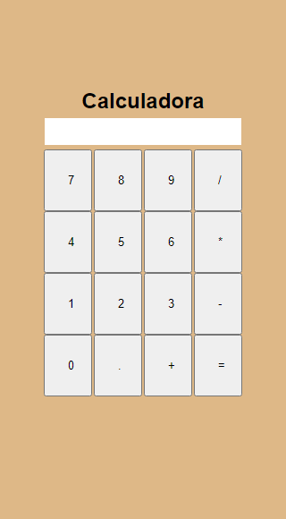

# Calculadora simples

Nesse projeto, o objetivo foi criar uma calculadora. Assim, sempre que o usuário aperta em determinado botão e tipo de operação é gerado a conta. Foi desenvolvido em HTML, CSS e JavaScript.

## Layout

## Stack utilizada

**Front-end:** HTML, CCS, JavaScript

## Vendo na prática

https://devamauryjununior-calculadora.netlify.app